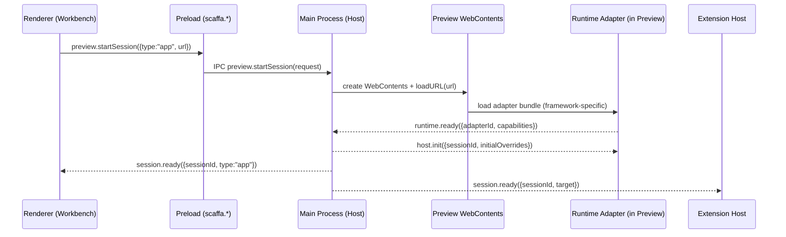
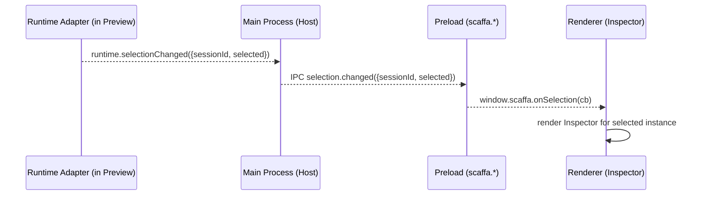
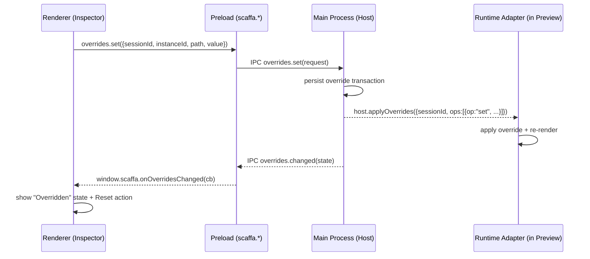
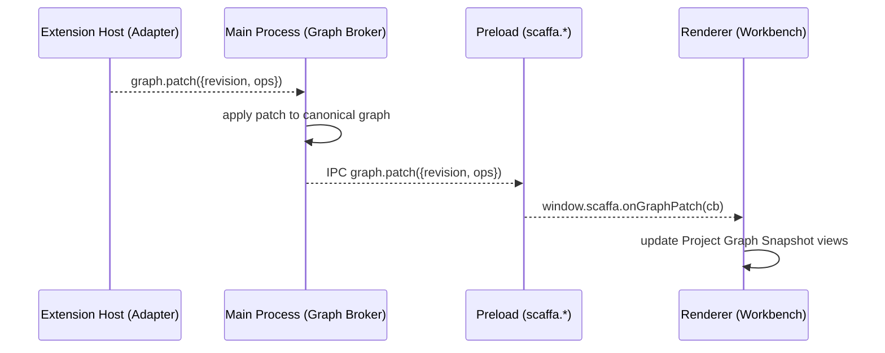

# IPC Boundaries + Key Sequence Diagrams (v0)

> **Status:** Draft / v0 shape  
> **Audience:** Scaffa core contributors and adapter authors  
> **Goal:** Capture critical cross-process flows as concrete sequence diagrams aligned with the multi-process architecture.

Related:
- [Architecture Plan](./index.md)
- [Scaffa Preview Session Protocol](./scaffa_preview_session_protocol.md)
- [Scaffa Runtime Adapter Contract](./scaffa_runtime_adapter_contract.md)
- [Scaffa Project Graph Schema + Patch Protocol](./scaffa_project_graph_schema.md)
- [Scaffa Override Model + Persistence](./scaffa_override_model.md)

---

## 1. Process Boundaries (Canonical)

Scaffa is a multi-process Electron app:

- **Renderer (Workbench UI):** React UI, no Node/Electron APIs
- **Preload (Gateway):** typed capability surface exposed to the renderer
- **Main (Host):** owns windows, preview sessions, privileged capabilities
- **Extension Host:** runs modules (registries, adapters, graph producers)
- **Preview Runtime:** app/component code executing in a session `WebContents`
- **Runtime Adapter:** framework-specific code running inside the preview runtime

---

## 2. Start Preview Session (App)

---

## 3. Selection Flow (Click-to-Select → Inspector)

---

## 4. Apply Override (Inspector Edit → Preview Update)

---

## 5. Graph Patch Propagation (Adapter → Consumers)

---

## 6. Notes / Alignment Constraints

- Renderer never talks directly to extension host or preview runtime; it uses preload APIs.
- Main is the broker/authority for sessions and cross-boundary routing.
- Sequence diagrams assume trusted v0 environment; permission/sandboxing layers can be added later without changing message intent.
