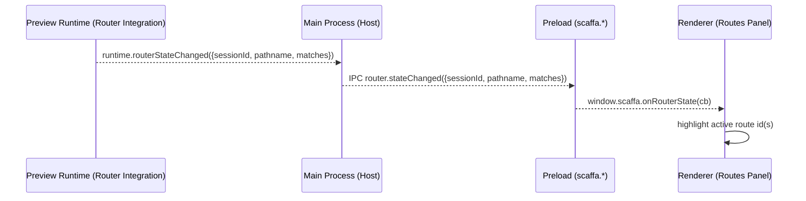
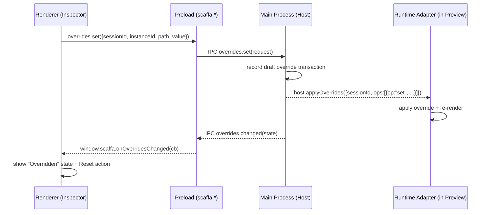
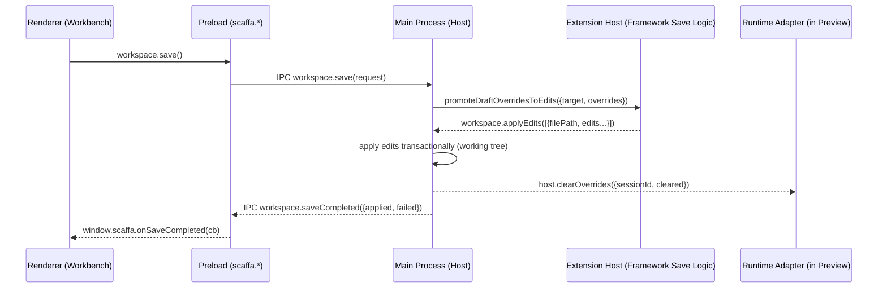
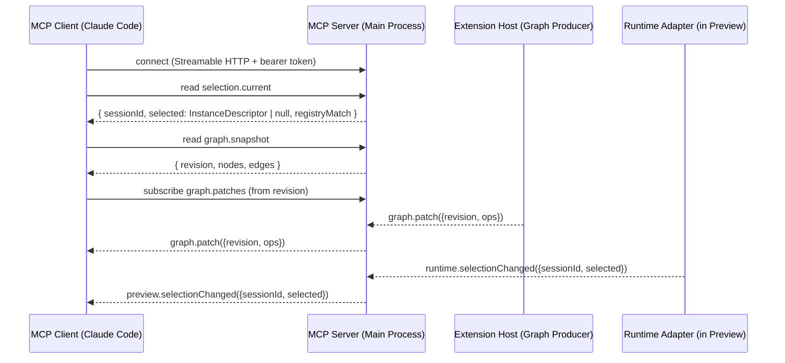

# IPC Boundaries + Key Sequence Diagrams (v0)

> **Status:** Draft / v0 shape  
> **Audience:** Scaffa core contributors and adapter authors  
> **Goal:** Capture critical cross-process flows as concrete sequence diagrams aligned with the multi-process architecture.

## Agent TL;DR

- Load when: debugging or changing **cross-process flows** (renderer↔preload↔main↔extension-host↔preview-runtime).
- Primary value: canonical process boundary definitions + mermaid diagrams for session start, selection, and override flows.
- Don’t load when: you only need the data model (`docs/scaffa_override_model.md`) or registry schema (`docs/scaffa_component_registry_schema.md`).
- Also load: `docs/scaffa_preview_session_protocol.md` for the precise contract terms used in the diagrams.

Related:
- [Architecture Plan](./index.md)
- [Scaffa Preview Session Protocol](./scaffa_preview_session_protocol.md)
- [Scaffa Runtime Adapter Contract](./scaffa_runtime_adapter_contract.md)
- [Scaffa Project Graph Schema + Patch Protocol](./scaffa_project_graph_schema.md)
- [Scaffa Override Model + Persistence](./scaffa_override_model.md)
- [Scaffa MCP Server Contract](./scaffa_mcp_server_contract.md)

---

## 1. Process Boundaries (Canonical)

Scaffa is a multi-process Electron app:

- **Renderer (Workbench UI):** React UI, no Node/Electron APIs
- **Preload (Gateway):** typed capability surface exposed to the renderer
- **Main (Host):** owns windows, preview sessions, privileged capabilities
- **Extension Host:** runs modules (registries, adapters, graph producers)
- **Preview Runtime:** app/component code executing in a session `WebContents`
- **Runtime Adapter:** framework-specific code running inside the preview runtime

---

## 2. Start Preview Session (App)

---

## 3. Selection Flow (Click-to-Select → Inspector)

---

## 4. Active Route Highlight (Router State → Routes Panel)

When a router integration is present, the preview runtime can emit “active route” state so the Workbench can highlight the currently displayed route without guessing.

---

## 5. Apply Draft Override (Inspector Edit → Preview Update)

---

## 6. Save Changes to Disk (Promote Draft Overrides → Code)

Saving converts draft overrides into workspace edits (working tree) and clears the saved draft overrides.

Notes:
- The framework-specific “promote to code” logic lives in extensions/adapters; core applies edits.
- If promotion fails for some overrides, Scaffa keeps them as draft overrides and surfaces the failure (no silent dropping).

---

## 7. Graph Patch Propagation (Adapter → Consumers)

---

## 8. MCP Observability (External AI Tool ↔ Host State)

MCP clients are northbound consumers of the same canonical state as the renderer UI.

---

## 9. Notes / Alignment Constraints

- Renderer never talks directly to extension host or preview runtime; it uses preload APIs.
- Main is the broker/authority for sessions and cross-boundary routing.
- Sequence diagrams assume trusted v0 environment; permission/sandboxing layers can be added later without changing message intent.
